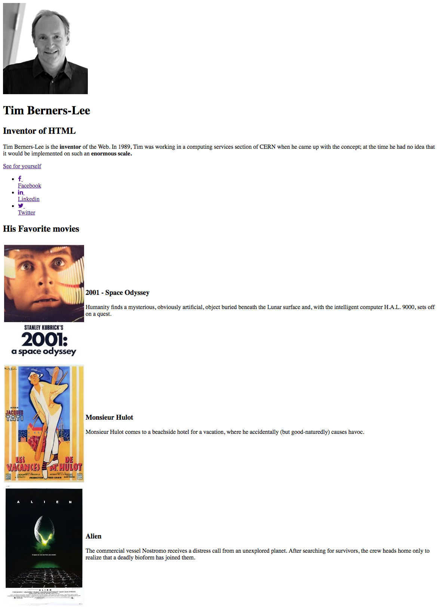

# Introduction

## Skills

- Understanding
- Autonomy
- Organization
- Execution
- Presentation

## Objectives

- Make a page on Tim Berner Lee
- Understand the principles of HTML and CSS
- Present your page and code

## Briefing

### Step 1 : Git

- Create a repo on GitHub called **starting-web-development**
- Clone the repo on your local machine

### Step 2 : HTML

Apply the next practicle steps to the folder **"starting-web-development"** 

- Create a file **index.html**
- Create a file **style.css**
- Create a folder **images**
- Download this image in the folder **images** : 
- Download this image in the folder **images** : 
- Download this image in the folder **images** : 
- Download this image in the folder : 

- In **index.html** write HTML code resulting to exactly this images 
  - The link to Tim Berners-Lee's Wikipedia : https://fr.wikipedia.org/wiki/Tim_Berners-Lee
  - To have Icons use this :
  
```html
  <link href="http://maxcdn.bootstrapcdn.com/font-awesome/4.2.0/css/font-awesome.min.css" rel="stylesheet">
```
  - To browse Icons go to [FontAwesome](http://fontawesome.io/icons/)

### Step 3 : CSS

- Make it so your page looks like this 
- To have a pretty font use this :

```html
<link rel="stylesheet" href="http://fonts.googleapis.com/css?family=Open+Sans:400,300,700|Montserrat:400,700">
```
- Follow the link to know how to use [Google Font](https://fonts.google.com/?query=open&selection.family=Montserrat|Open+Sans)
- Add several `div`s in HTML to seperate the elements as blocks 
- In **style.css**
  - Reposition the `div`s
  - Center the `div`s
  - Fill the background of the `div`s
  - Changer the font color
  - Align the text

### Étape 4 : Save with Git

- Make an `add`
- Followed by `commit`
- Then a `push`
- Go on your GitHub profile to verify the changes

### Étape 5 : Presentation

- Present your code
- Explain your hurdles/difficulties


